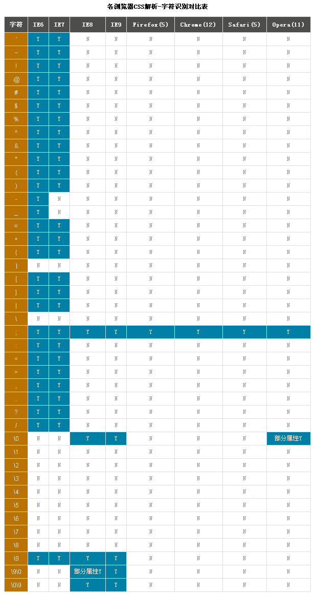

## CSS Hack学习
---

### 什么是CSS Hack

作为一个前端，在工作中可能时常会被要求解决浏览器兼容问题，那前端涉及到的HTML、JavaScript和CSS都会遇到浏览器兼容性问题。本文主要想聊一聊解决浏览器兼容性中CSS的部分，谈到CSS浏览器兼容性问题，就不得不说说CSS Hack。那什么是CSS Hack，我就按照自己的想法尝试总结一下。同时附上百度文库对CSS Hack的定义。

百度文库的定义：

> 简单地讲，css hack指各版本及各品牌浏览器之间对CSS解释后出现网页内容的误差(比如我们常说错位)的处理。由于各浏览器的内核不同，所以会造成一些误差就像JS一样，一个JS网页特效，在微软IE6、IE7、IE8浏览器有效果，但可能在火狐（Mozilla Firefox）谷歌浏览器无效，这样就叫做JS hack ，所以我们对于CSS来说他们来解决各浏览器对CSS解释不同所采取的区别不同浏览器制作不同的CSS样式的设置来解决这些问题就叫作CSS Hack。

我的定义：

> CSS Hack，就是在CSS样式中添加一些特殊的标识，而这些特殊的标识在不同浏览器或相同浏览器的不同版本可以被区别采用，已达到在不同浏览器之间或相同版本不同版本之间达到一致性。

### 什么情况下会需要CSS Hack

在我的工作经历中，一般像偏传统企业会比较要求解决浏览器兼容性问题，尤其是需要解决IE6、IE7、IE8、IE9的兼容性，当时为了解决这个问题，也是病急乱投医，上网看看哪段代码能用，就粘过来试试，觉得可以行的通就ok了。后来闲下来的时候才看到原来还有这么个东西可以解决CSS浏览器兼容性。

### 浏览器识别字符标准对应表

